# Симуляція навчального процесу (Варіант 8)

Повноцінний N-Tier консольний застосунок на TypeScript (для середовища `Bun.js`), який моделює процес вивчення університетських дисциплін. Система підтримує повний CRUD для всіх сутностей та дотримується принципів SOLID, DRY, KISS, YAGNI та Law of Demeter.

## Особливості

-   **N-Tier Архітектура**: Чіткий поділ на шари `Core` (Моделі, Інтерфейси, Типи), `DAL` (Сховище даних), `BLL` (Бізнес-логіка та валідація) та `PL` (Консольний інтерфейс).
-   **Повний CRUD**: Можливість створювати, переглядати, оновлювати та видаляти Студентів, Викладачів, Групи, Підгрупи та Дисципліни через зручне консольне меню.
-   **Поведінковий шаблон Observer (Менеджер Подій)**: Сповіщення про зміни в системі (наприклад, виконання лабораторної чи системні повідомлення) генеруються в `BLL` та перехоплюються в `PL`. Бізнес-логіка не містить жодного `console.log`.
-   **Структурний шаблон Facade**: `UniversityService` ховає складну логіку перевірок (зайнятість викладачів, вимоги до годин, наявність обладнання) від `ConsoleUI`.
-   **Творчий шаблон Factory Method**: Створення складних об'єктів дисциплін (наприклад, `Basics of Programming` чи `OOP`) винесено у фабрику.
-   **Поліморфізм (Загальний інтерфейс)**: Студенти та Викладачі реалізують спільний інтерфейс `IUniversityMember` для формування загального довідника університету.

## Інструкція з запуску

1.  Впевніться, що у вас встановлено [Bun](https://bun.sh/).
2.  Клонуйте репозиторій.
3.  Запустіть проект командою:
    ```bash
    bun run index.ts
    ```

## Архітектура класів (UML Діаграма)

```mermaid
classDiagram
    %% CORE - Interfaces & Types
    class IUniversityMember {
        <<interface>>
        +id: string
        +name: string
        +role: string
        +getDetails() string
    }

    class IObserver~T~ {
        <<interface>>
        +update(args: T) void
    }

    class Equipment {
        <<enumeration>>
        None
        PC
        Laptop
    }

    class ActivityType {
        <<enumeration>>
        Lecture
        Lab
        Coursework
        MCW
        Exam
        Credit
    }

    class CourseLevel {
        <<enumeration>>
        First
        Second
        Third
        Fourth
    }

    %% CORE - Events
    class EventDispatcher~T~ {
        -observers: IObserver~T~[]
        +subscribe(observer: IObserver~T~) Subscription~T~
        +notify(args: T) void
    }

    class Subscription~T~ {
        +unsubscribe() void
    }

    %% CORE - Entities
    class Student {
        +id: string
        +name: string
        +equipment: Equipment
        +passedWorks: number
        +role: string
        +updateProfile(name, equipment) void
        +completeWork() void
        +completeExam() void
        +getDetails() string
    }

    class Teacher {
        +id: string
        +name: string
        +activeDisciplineName: string | null
        +role: string
        +updateName(name) void
        +assignDiscipline(disciplineName) void
        +unassignDiscipline() void
        +getDetails() string
    }

    IUniversityMember <|.. Student
    IUniversityMember <|.. Teacher

    class Group {
        +id: string
        +courseLevel: CourseLevel
        +updateCourseLevel(level) void
        +addStudent(student) void
        +removeStudent(studentId) void
        +getStudents() Student[]
    }

    class Subgroup {
        +id: string
        +parentGroup: Group
        +setStudents(studentsList) void
        +getStudents() Student[]
    }

    class DisciplineActivity {
        +type: ActivityType
        +hours: number
    }

    class Discipline {
        +name: string
        +totalHours: number
        +allowedCourses: CourseLevel[]
        +hasCredit: boolean
        +hasExam: boolean
        +updateDetails(totalHours, allowedCourses) void
        +addActivity(activity) void
        +assignTeacher(teacher, subgroupsCount) void
        +removeTeacher(teacherId) void
        +getTeachers() Teacher[]
        +isCourseAllowed(course) boolean
    }

    class DisciplineFactory {
        +createOOP() Discipline$
    }

    Group o-- Student
    Subgroup o-- Student
    Subgroup --> Group
    Discipline o-- Teacher
    Discipline *-- DisciplineActivity

    %% DAL - Data Access Layer
    class DataContext {
        +students: Map~string, Student~
        +disciplines: Map~string, Discipline~
        +groups: Map~string, Group~
        +subgroups: Map~string, Subgroup~
        +teachers: Map~string, Teacher~
    }

    %% BLL - Business Logic Layer
    class UniversityService {
        +onStudentActivity: EventDispatcher~StudentActivityEventArgs~
        +onSystemNotification: EventDispatcher~SystemNotificationEventArgs~
        -db: DataContext
        +getDirectory() IUniversityMember[]
        +createStudent(...)
        +updateStudent(...)
        +deleteStudent(...)
        +createGroup(...)
        +createTeacher(...)
        +assignTeacherToDiscipline(teacherId, disciplineName)
        +conductLabWork(studentId, disciplineName)
    }

    UniversityService --> DataContext
    UniversityService --> EventDispatcher

    %% PL - Presentation Layer
    class ConsoleObserver {
        +update(args) void
    }

    class ConsoleUI {
        -rl: readline.Interface
        -service: UniversityService
        +start() Promise~void~
        -crudGroups() Promise~void~
        -crudStudents() Promise~void~
        -crudTeachers() Promise~void~
        -crudDisciplines() Promise~void~
        -operationsMenu() Promise~void~
    }

    ConsoleObserver ..|> IObserver
    ConsoleUI --> UniversityService
    ConsoleUI --> ConsoleObserver
```


